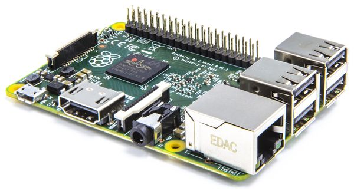
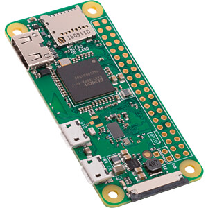
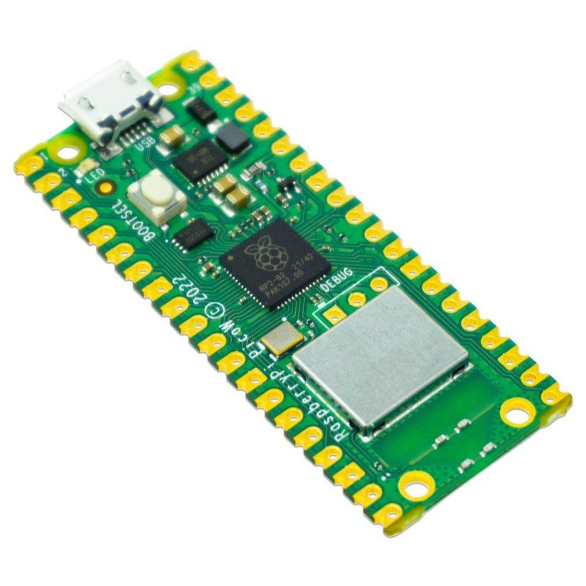

# Raspberry Pi (RPi)
Raspberry Pi related docs and projects

Raspberry Org Homepage [Products](https://www.raspberrypi.org/products/)

  
 

## Used Hardware / Projects (private)

* [Raspberry Pi **3 Modell B**](https://github.com/griemide/RPi3B) 2016-10 (Desktop) - 
Applications: Kodi, [Flightradar24](https://github.com/griemide/RPi3B/tree/master/Flightrader24), [Homebridge](https://github.com/griemide/RPi3B/tree/master/Homebridge), [MQTT broker](https://github.com/griemide/mqtt) 
* [Raspberry Pi **Zero W 1**](https://github.com/griemide/RPiZW) 2020-10 (DIN Rail) - 
Applications: [Node-RED](https://github.com/griemide/Node-RED), [MQTT broker](https://github.com/griemide/mqtt) 
* [Raspberry Pi **Zero W 2**](https://github.com/griemide/RPiZW2) 2020-11 (Power Strip) - 
Applications: [Node-RED](https://github.com/griemide/Node-RED), [MQTT broker](https://github.com/griemide/mqtt) 
* [Raspberry Pi **Zero W 3**](https://github.com/griemide/RPiZW3) 2021-01 (Test-System only, e.g. [Node-RED](https://github.com/griemide/Node-RED))
* [Raspberry Pi **Pico W 1**](https://github.com/griemide/RPiPW1) 2023-04 (Test-System only, e.g. [MicroPython](https://github.com/griemide/MicroPython))
* [Raspberry Pi **Pico W 2**](https://github.com/griemide/RPiPW2) 2023-04 (af104-fsz,  [MicroPython](https://github.com/griemide/MicroPython))


## Configuration
Change Hostname, Timezone, ecetera  
Manual [Grundkonfiguration](http://www.elektronik-kompendium.de/sites/raspberry-pi/1906291.htm) - german
```sudo raspi-config```  
E.g. Timezone [example](images/raspi-config_locales.jpg)  

## Backup
Guide [Backup](https://www.raspberrypi.org/documentation/linux/filesystem/backup.md)  
Blog [Backup im laufenden Betrieb](https://hilftdirweiter.de/backup-des-raspberry-pi-im-laufenden-betrieb/) (deutsch)  
Tool [MiniTool Partition Wizard Free](https://www.minitool.com/)

## References
* Elektronik Kompendium [Raspberry Pi](http://www.elektronik-kompendium.de/sites/raspberry-pi/index.htm)


